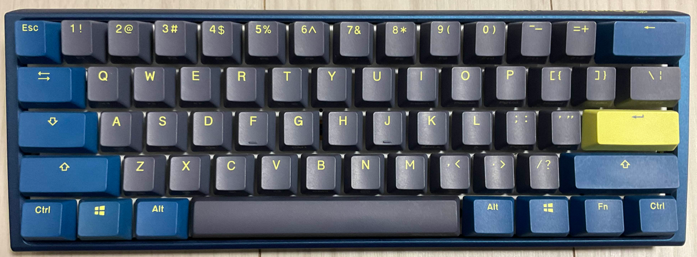
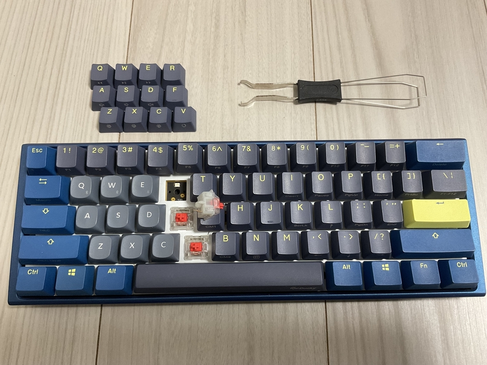
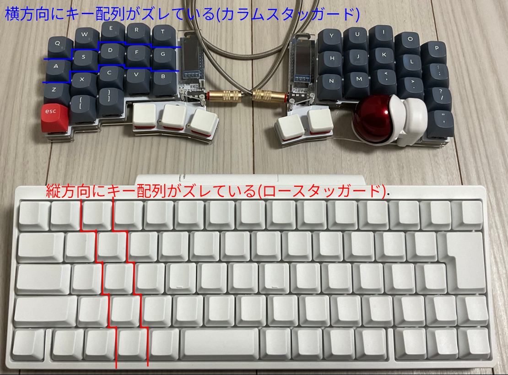
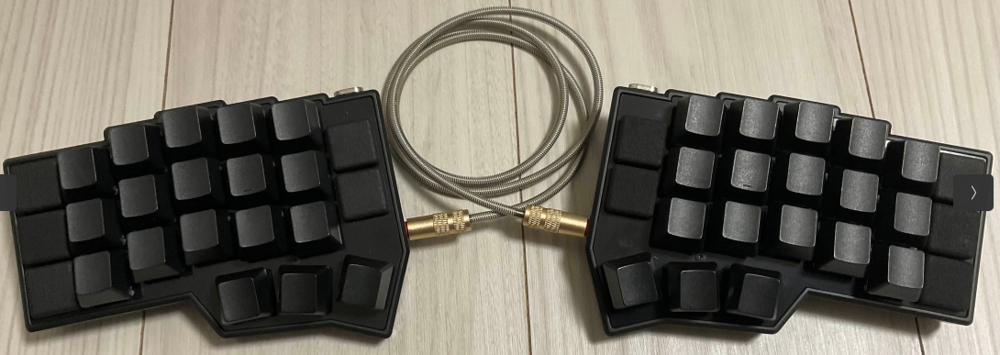

+++
title = "自作キーボード沼にハマっている話"
date = 2024-12-22

[taxonomies]
tags = ["keyboard", "Advent Calendar"]
+++

この記事は[フィヨルドブートキャンプ Part 1 Advent Calendar 2024](https://adventar.org/calendars/10357)の22日目の記事です。[Part2](https://adventar.org/calendars/10807)もあります。  
昨日はYuukagoさんの[初めてオフラインイベントを主催した話【フィヨブーボドゲ会2024】](https://yuukago.hatenablog.jp/entry/2024/12/21/200019)でした！

## はじめに

自分はキーボードが好きで、理想のキーボードを探しています。  
その中でも自作キーボードは自由度が高いので、より理想的なキーボードが見つかりやすいと思います。  
今回は自作キーボードの面白い部分を伝えたくて記事を書きました！

## 自作キーボードを始めたきっかけ

もともと、Ducky One 3 Miniというキーボードを愛用していました。  

このキーボードは以下の特徴が気に入っていました。

- 60%サイズのコンパクトなキーボードなのでマウスまでの距離が近くなって取り扱いやすい
- US配列なのでEnterキーが横長になっていて、ホームポジションを崩さず改行できる
- メカニカルキーボードなので、キースイッチ、キーキャップが自由に変更できる

このキーボードもすごく気に入っていたのですが、社内で自作キーボードを使っていた人から勧められたことがきっかけで自作キーボードについて調べ始めました！  
ここから深い沼にハマるという事も知らずに...。

## 自作キーボードの良さ

自作キーボードについて調べていく内に、既成品のキーボードにはない魅力に惹かれました。  
ここでは自分が感じた魅力を2点紹介します。

### デザインの選択肢が豊富

キーボードデザインやキー配列のバリエーションが多いのが1つの魅力だと思います。  
たとえば、以下のような特徴を持つ自作キーボードがあります。

- キーボードにトラックボールが一体化されている
  - マウスが不要になる
- 一般的なキーボードはロースタッガード(row staggered)が多いのに対して、カラムスタッガード(column staggered)なキーボードもある
  - キーボードに指を置く際に、自然な形で置ける
- 親指を活用できるキー配列がある
  - 親指の使用率を上げることで、他の指の負担を減らせる

参考: [staggered layout(scrapbox.io)](https://scrapbox.io/self-made-kbds-ja/staggered_layout)

### 愛着が持てる

半田付けしたり、スイッチやキーキャップ、ケースを自分で組み立てるので完成させると達成感があり、すごく愛着が湧きます！  
キーボードがどういう部品で構成されているかを知るきっかけにもなりました。  
あとは、キースイッチ、キーキャップ、その他備品を自分で選択するので、組み合わせ的に他の人とかぶることはほぼ無いので、オリジナルのキーボードになるのも嬉しいです😊

## 自作キーボードの始め方

自作キーボードは種類がとても多いので、初めて調べ始めた時は何を基準に選べば良いのか分からず困っていました。  
考えるポイントを決めれば選びやすかったかなと思ったので、自分が決めた時のポイントについて書きます。

### 好きなデザインを見つける

- 左右分割したいか

左右分割キーボードの利点としては、キーボードの位置を肩幅に合わせられるので肩が凝りにくいと言われています。  
個人的には左右分割の方が見た目が好きです。少し気になる点としてはマウスを置く位置と被ってしまうので、マウスが若干扱いにくくなることです。

- 物理キーの数

大きく100%, 60%, 40%サイズのキー配列があります。  
60%サイズは最初に画像を貼ったDuckyと同じようなサイズで、ファンクションキー、テンキー等がないため代わりにFnキー+他キーを押して無いキーを補うことになります。  
40%サイズはそこからさらに数字キー列と記号キーと修飾キーを削ったものです。40%くらいになるとそのままではキー数が足りないので特定のキーをレイヤーキーとして割り当てて、そのキーを押しながら他のキーを押すと記号が入力できる、というような設定が必要になります。  
~%というのはあくまで目安なので同じ%でもキーの数が違います。

- 見た目

自作キーボードは本当に多種多様で、同じ左右分離でキーサイズが同じくらいのものでも見た目が違うというところが面白いところだと思っています。  
毎日触るものだと思うので、最終的には見た目が気に入ったものを選ぶというのも良いんじゃないかなーと思います。

### 実際に触ってみる

自作キーボードは本当にいろんな種類があるので、実際に触ってみたほうが自分にしっくりくるものを決めやすいかもしれないです。  
いくつか自作キーボードを触れる場所、イベントを紹介します。

- イベント
  - [天下一キーボードわいわい会](https://tenkey.connpass.com/)
  - [キーボードマーケットトーキョー](https://keyket.jp/tokyo-2025)
- 店舗
  - [遊舎工房](https://yushakobo.jp/shopinfo/)

自分の場合は欲しい自作キーボードのあたりを付けた後、遊舎工房に触りに行って決めました。  

### 本体以外のパーツをそろえる

自作キーボードは本体だけではなく、キースイッチ、キーキャップ、左右分割タイプの場合は左右をつなぐためのTRRSケーブル(3.5mm, 4極)を揃える必要があります。  
この辺りは初めからこだわりすぎると大変なので、ざっくりと書きます。

- キースイッチ

大きく分けると、「Cherry MX 互換スイッチ」というよく使われているものと、「ロープロファイル」と呼ばれる薄型のものがあります。  
これはキーボード本体がどちらに対応しているかによって決まります。  
選ぶポイントは、押した時の感触の違い(リニア、タクタイル、クリッキー)と、押すのに必要な力(45g, 55gなど)の2点です。  
よく使われているのはリニアの45gで通称「赤軸」と呼ばれているものです。  
分かりやすい記事がいくつかあったので、リンクを貼っておきます。

[遊舎工房：おすすめスイッチ](https://shop.yushakobo.jp/pages/recommendswitch?srsltid=AfmBOop9hWB8S_POYZOHOn7Vr7rix1AdjoEPk9jQfLawF8WsXTlreNJI)  
[アーキサイト：キーボードスイッチの選び方](https://archisite.co.jp/pick-up/keyboard-switch/)

- キーキャップ

基本的に見た目が好きなものを選ぶのですが、自作キーボードのキーは特殊キー(文字、記号、数字キー以外のキー)も文字キー等と同じサイズのことが多いため、  
キーキャップを買う時はその点に注意しないといけないです。  
あとは、アルチザンキーキャップというものがあり、これは普通のキーキャップとは違い装飾されたものです。キーがゲーム機になっていたり、顔文字になっていたり、他にもいろいろあって面白いので調べて見てください😆  

### 組み立てる

ここまで来ればあとは組み立てるだけです！  
具体的な組み立て方は自作キーボード本体によって違うので割愛します。  
自作キーボード本体に説明書が付属していたり、オンライン上にビルドガイドがあるので、ガイド通りに組み立てることになります。  
半田付けなど、ガイドに書かれている説明文と画像だけで分かりづらい場合はYoutube上で組み立て動画があったりするので、そちらを参考にするのも良いと思います。  
遊舎工房には工作室も用意されていて、そこで工具をレンタルできたり半田付け講習サービスもあるのでおすすめです。初めて自作キーボードの半田付けした際にミスをして自分で解決できなくなった時に相談させていただいて、お世話になりました🙏

## 今使っている自作キーボード

最近買った自作キーボードと選んだポイントについて紹介します。  
Corne V4 Cherryというキーボードです。  

### 選んだポイント

- 左右分割タイプ、左右対称
  - 左右分割なのは見た目が好みだからです
  - 一般的なキーボードの場合、特に右小指で押すキーの数が15キー程あり、一番自在に動かせない指に一番多くの負担がかかっているのが不満でした。左右対称を選んだのはなのはできるだけ各指の負担を均等にしたかったからです
- キー数
  - 46キーあります。この内、10キーは使わないようにして36キーを使うようにしています。これはホームポジションから1キー分だけ指を動かすだけでどのキーも押せるようにしたかったからです
- PRK Firmwareに対応している
  - Corne V4 CherryにはPR2040というマイコンが搭載されていて、PRK Firmwareがこのマイコンに対応しています。Rubyが好きなので、PicoRubyで書かれたFirmwareを使いたいなーと思ったのがきっかけです
  - 利点としては、論理キー配列の書き換えが楽というポイントがあります。ビルド不要なので、keymap.rbを書き換えてファイルを上書きするだけで論理キー配列を変えることができます

[PRK Firmware](https://github.com/picoruby/prk_firmware)  
[PRK Firmware 紹介動画(youtube.com)](https://www.youtube.com/watch?v=5unMW_BAd4A)

## おわりに

自作キーボードのことについていろいろ書いたのですが、実はまだコーディングの際には自作キーボードを使えていないです😅  
36キーしか使っていないので、論理キー配列を調整する必要があるのですが、なかなか良い配列が見つからず調整し続けています。  
キースイッチ、キーキャップ、論理配列などなど、まだまだこだわりたい部分が多くあるので、これからも理想のキーボード探しを続けようと思っています💪💪  
一緒に自作キーボードを楽しめる仲間が増えれば嬉しいので、この記事を読んで少しでも興味を持っていただけたら幸いです😃

明日はkomagataさんのマクロパッドの活用についての記事です！
