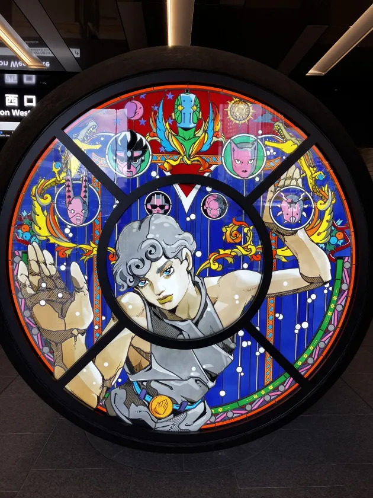

+++
title = "大阪Ruby会議04に参加してきた！"
date = 2024-08-26

[taxonomies]
tags = ["Ruby", "conference"]
+++

8/24(土)に開催された[大阪Ruby会議04](https://rubykansai.github.io/osaka04/)に参加してきたー！  
カンファレンスに参加したのは去年の10月に開催されたKaigi on Rails 2023が最初だから、10ヶ月ぶり？くらいの参加かな。  
会場は中之島フェスティバルタワー・ウエストってところで、ビルがめっちゃキレイなところで入る時めっちゃ緊張した🤣  

確か2-3週間くらい前に大阪Ruby会議04が開催されることを知ったけど、最初は「行きたいけど遠いしちょっときついな」と思って諦めて全然スケジュール見てなかった。  
ちょうど開催1週間前になんとなくスケジュール見て、発表内容がめっちゃ気になってちょっと無理して予定空けて参加した！  
本当に参加して良かったーーー！！！

## 特に印象に残った発表

正直全部の発表が刺激的で面白かったけど、特に自分に刺さった発表を残しとく。

### Keynote: 最高の構文木の設計 2024年版

抽象構文木、具象構文木があるということを知った。  
構文木を解析する時、ツリーを

- 上から下へ
- 下から上へ
- 上から下 + 下から上へ

解析するパターンがあるということを知った。それぞれユースケースが違う。  
他にもいろいろメモしたけど、理解度が低いから金子さんのブログを見て復習するかー。

[Ruby Parser開発日誌 (19) - 最高の構文木の設計 2024年版](https://yui-knk.hatenablog.com/entry/2024/08/23/113543)

[LR parser 101](https://github.com/yui-knk/lr-parser-101)という構文解析のhello world的なチュートリアルがあるらしい。  
確かドラゴンブックを半分くらい読んだ人だと分かりやすいと話されてたはず。  
会議中、何回かドラゴンブックの話しが出てきてめっちゃ気になってた🤣  
調べてみるとこの本のことみたい。気になる👀

[コンパイラ[第2版]\(ドラゴンブック\)](https://www.saiensu.co.jp/search/?isbn=978-4-7819-1229-5&y=2009#index)

### Rustで作るTreeSitterパーサーのRubyバインディング

RustでTreeSitterパーサーのRubyバインディングを実装する話だった。  
難しすぎて9割程は理解できなかったけど、

- magnusというCrateを使えば、Ruby APIとやり取りする箇所がコーディングしやすくなる
- C言語と比較して、メモリ安全のための制約があるためしんどい部分がある
- C言語で文字列を扱うのはかなりしんどい、Rustは比較的最近の言語なのでそこらへんは楽

ということを知った。  
まずは放置してるパーフェクトRubyの「C言語でライブラリの作成」の章を読みたくなった（読む！）

### Keynote: 令和の隙間産業——PicoRubyはどこから来て、どこへ行くのか

RubyKaigiの80%のトークはすぐには役に立つものじゃないけど、後に役立つこともある。  
隙間産業 = ちょっとしたプロダクト、を持とうという話し。  
お誘いを受けてC言語があまり分かっていない状態でPicoRubyを触るようになってから、PR2040で動かせるようにするまでの話しがめちゃめちゃ面白かった！  
キーボードが好きだからPRK Firmwareはめちゃめちゃ気になった。

[@hachiblogさんのツイート](https://x.com/hachiblog/status/1827651615949754574)

ちょうど面白そうな題材が紹介されてたから、こっちもやってみようかなー。

## After Party

顔見知りの方がほぼいない状態の参加だったので、途中で帰ろうか迷うくらい不安だった😂  
参加してみると、話しかけてくださる人がいて、案外会話に参加できてすごく充実してた。  
「Ruby会議初参加で理解できた事少なかったんですけどめっちゃ面白かったです！」って話してたら「それ、RubyKaigiあるあるですよ」って教えてもらった。  
Ruby/Rails開発経験がまだ浅い自分にも気さくに話しかけて下さる方がいて、本当に楽しかったし嬉しかったなー

## Rubyコミュニティについて

他の言語コミュニティに入ったことないけど、Rubyコミュニティの人たちは技術について本当に楽しそうに話される方が多いと思った。  
「自分もこの方たちみたいになりたいな」と思えた。

## 感謝！！！

運営、登壇者、参加者、スポンサーの方々には本当に感謝しかないです。  
本当に充実した1日を過ごせました、ありがとうございました！！！

## おまけ

大阪駅に展示されてるThe Fountain Boy。めっちゃ見たかったやつ！！  
一番上のスタンドは9部主人公のスタンド、ノーベンバーレインっていうらしい。名前かっこいい

