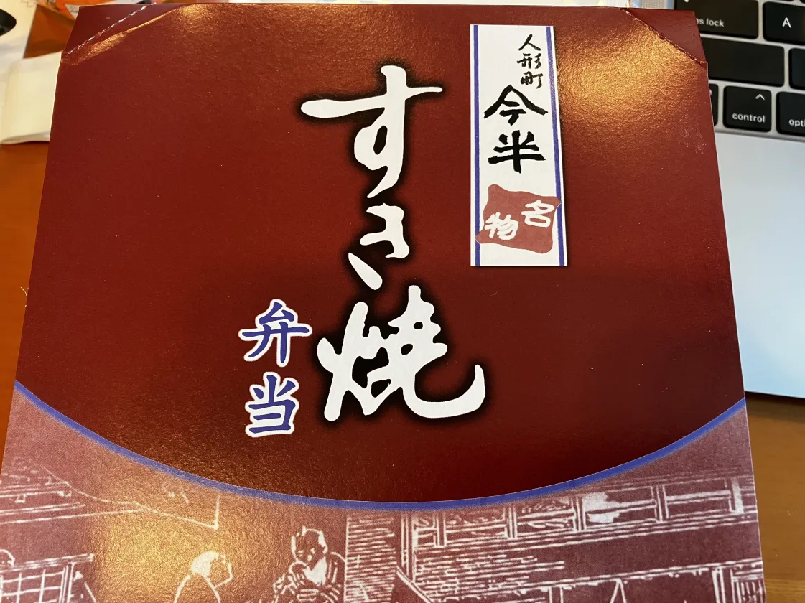
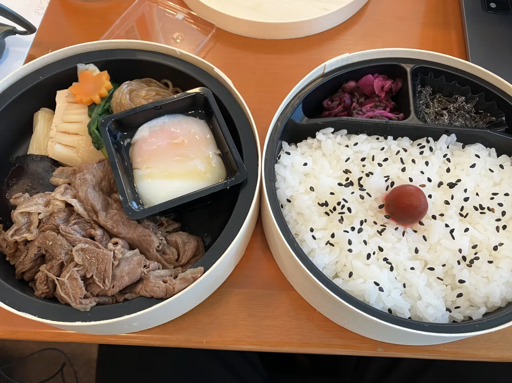

+++
title = "VimConf 2024に参加しましたー"
date = 2024-11-26

[taxonomies]
tags = ["Vim", "conference", "VimConf"]
+++

11/23(土)に開催された[VimConf 2024](https://vimconf.org/2024/)に参加してきました！  

会場はアキバプラザ・アキバホールでした。秋葉原駅から近かったので、他のカンファレンスに行く時にいつも迷うのですが今回は迷うことなく到着できました！  
ホールに入ってから名札をいただいたのですが、名札に自分のアイコンが付いていたのが印象的でした。「ネット上でのアイコンと名前は分かるけど、リアルで会うと誰か分からない！」が解消されそう。  
Vim歴が半年くらいなのと、VimConf初参加なのでドキドキしていましたが、結果的に大いに楽しむことができました！

## 印象に残ったセッション

全てのセッションが面白かったのですが、技術的に理解できなかった部分も多かったので特に印象に残ったセッションについて記録を残そうと思います。

### Keynote - The new Vim project - What has changed after Bram

Christian Brabandtさんの発表。Vimコミュニティの話しでした。Vim作者のBramさんがこれまでどういった活動をされていたのか、亡くなられた後どんな活動をしているのか、これからどうしたいのかという話しをされていました。  
コミュニティ活動を続けるということはコードを書く以外にもしないといけないことが多くあり、その内の多くをBramさんがされていたということに驚きました。  
お話の中で何度も「Vimコミュニティを健全に保つことを一番考えている」という言葉があり、強調されていたことが印象的でした。

### Keynote - (Neo)Vim Made Me a Better Software Developer

TJ DeVriesさんの発表。kickstart.nvimの設定でNeovimを使い始めて、Youtubeで説明動画を観ていたこともあり、唯一知っている方でした。  
Better Software Developerについてのお話でした。その中でも印象的だったのは、playgroundを探して手を動かすことが大切、playgroundがあることでアイデアを試すことができるし、閃きが得られるということでした。  
TJさんにとってはNeovimがplaygroundということでした。
自分が何かに熱中する時はいつも、いろいろ試行錯誤して自分なりにより良い方法を見つけることだったと思いました。このplaygroundという考え方はとてもしっくりきましたし、分かりやすいお話と例えで言語化してくださったので自分の中での気づきが多かったので印象に残りました。  
途中で小さな声で「playgroundはEmacsでもいいんですよ」という感じのジョークを言ってたのが面白かった。

### Lunch break

セッションではないですが、お昼ご飯も思い出に残るものだったので。  
vim-jp内でVimConfで出るご飯が美味しいということは聞いていたのですが、予想よりもさらに美味しかったので思い出に残りました！  
お弁当は多めに用意されていたようで、おかわりをいただきました。弁当とは思えないほどの肉の旨さ！しいたけも味がしっかり染み込んでいて最高でした。  

### Building Neovim Plugins: A Journey from Novice to Pro

2KAbhishekさんの発表。Neovimのプラグインを作るうえでの前提知識として、アイデア、実用的なLuaの知識、Lazy.nvim、プラグインテンプレートの準備が必要。  
プラグインを作成するにあたっての基礎的なところから、そこから応用的なプラグインをつくるまでの道のりを示してくださっていました。  
自分はまだNeovimをより良く使うために精一杯ですが、慣れてきたらプラグインの作成もしたいと思いました。  
あと、Tips for Plugin Authorsとしていくつか紹介されていたのですが中でも印象的だったのが  

- 自分の欲しい機能を作って最初のユーザーになる
- User Configurationを尊重する
- 楽しむ！(一番重要)

でした。自分の欲しい機能を作ることでモチベーション高く続けられそうだし、User Configurationを尊重することはVimmerらしいと思いました。  
最後の「楽しむ」はTJさんのplaygroundの話しと通じるところがあると思います。

### さいごに

初めてVimConfに参加してみて、ブログには書ききれないくらいの良い思い出が残りました。  
周りにVimを使っている人がほとんどいないのもあり、Vimmerというと尖った人が多い印象を若干持っていたので実は参加前に少し不安になっていた時がありました。  
参加前にvim-jpに入って、皆さんに暖かく皆さんが迎えてくださったおかげで参加のハードルが下がりました、ありがとうございます。  
そして、懇親会で話してくださった皆さん、素敵なカンファレンスを開催してくださった運営の皆さん、本当にありがとうございました！  
来年も参加したいと思える最高のカンファレンスでした！
